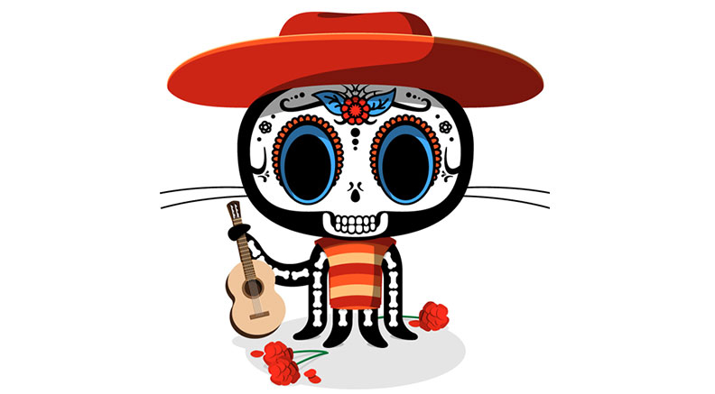

## Olá, conheça o Catrina!

O intúito deste projeto é ser um ponto de partida para você criar uma *landing page*, utilizando de recursos existentes de uma forma fácil e simples, você consegue fazer muito escrevendo pouco. Recentemente fiz alguns trabalhos que tinham necessidades parecidas, o cara queria mostrar as fotos do Instagram da empresa, ou fotos de determinadas hashtags, o outro queria o feeds do Twiiter, eles queriam que o usuário acessassem seu conteúdo mesmo sem internet e que enviasse um contato caso necessário, enfim.. Foram várias demandas e todas nada muito complicadas para fazer, porém estava levando um pouco mais de tempo do que queria pra fazer isso, então resolvi criar algo que me ajudasse nisso. :smile:

Existem generators, yeoman e o escambal então porque usar o catrina? Não estou lhe obrigando a usa-lo, apenas estou compartilhando o que faço, documentando e aprendendo mais :stuck_out_tongue:

Não se importe com a [página de apresentação](http://thulioph.github.io/catrina) que foi gerada, pois ela foi feita apenas como forma de demonstrar algumas das coisas que existem no projeto e será adaptada no futuro.

## Como usar?

É necessário que você tenha instalado na sua máquina [Sass](http://sass-lang.com), [Bower](http://bower.io/) e [Grunt](http://gruntjs.com/); Depois da instalação feita, clone o projeto e rode os comandos abaixo no terminal para prosseguir com as instalações das dependências.

```
npm install
```

```
bower install
```

```
http-server
```

O servidor irá rodar em: `http://localhost:8080` e basicamente você vai trabalhar com dois "ambientes" *src* e *dist*.

#### src
Nesta pasta contém os arquivos originais, imagens originais, arquivos comentados, libs, etc..

#### dist
Nesta pasta contém os arquivos minificados, otimizados e concatenados; E todo o processo é feito utilizando o Grunt.

#### JS

Vale a pena observar o arquivo [`grunt-config.json`](https://github.com/thulioph/catrina/blob/master/grunt-config.json) onde contém toda a estrutura dos plugins para o grunt e a regra para o src/dist. No final, você terá apenas 2 (dois) arquivos javascripts, um contendo suas dependências `libs.min.js` e outro contendo o código feito por você `scripts.min.js`.

Utilizo handlebars como template para inserir as fotos do instagram, acredito que desta maneira consigo trabalhar melhor do que criar o elemento, fazer o append e todo aquele bla bla bla..

A forma como é manipulado o javascript não possui documentação 100%, mas se você conhece JSON, deu uma olhada no código e digitou no console `APP` já vai pegar como funciona tudo.

Os dados do formulário são guardados em **Local Storage** caso não tenha acesso a internet e, será enviado quando a conexão for presente.


#### CSS

Para os estilos, os arquivos são organizados por:

- `libs`: os estilos responsáveis pelas bibliotecas do projeto.

- `base` : meus mixins, variáveis de cor, tamanho, largura, etc.. A base do meu css.

- `form` : contém os estilos para formulário, prefiro separar porque formulários sempre são chatinhos para trabalhar.

- `general` : todo o estilo que é em comum entre as páginas do projeto, neste caso todo o estilo. *as peculiaridades de determinada página caso tenha, eu prefiro separar do general criando uma nova folha de estilo.

- `reset` : resetando os estilos.

- `typography` : todos os estilos relacionados a tipografia, tamanho, estilo, peso, font-face, etc..

- `main` : chamada dos arquivos.

## Links de apoio?

Todas as dependências, técnicas e estilos usados no projeto, você encontra na internet de forma fácil, os links abaixo são das documentações que podem te auxiliar caso queira fazer algo a mais ou contribuir com esse projeto.

- [SASS](http://sass-lang.com/)
- [Grunt](http://gruntjs.com/)
- [Bower](http://bower.io/)
- [i18next](http://i18next.com/)
- [Google Trackin Events](https://developers.google.com/analytics/devguides/collection/gajs/)
- [Google Analytics](http://www.google.com/analytics/)
- [Simple Singleton Pattern](https://github.com/simplesingleton)
- [Instagram API](http://instagram.com/developer/)
- [Twitter Post Fetcher](https://github.com/jasonmayes/Twitter-Post-Fetcher)
- [Fancybox](http://fancyapps.com/fancybox/)
- [Handlebars](http://handlebarsjs.com/)
- [EditorConfig](http://editorconfig.org/)
- [Local Storage](http://diveintohtml5.com.br/storage.html)
- [APPCache](http://www.html5rocks.com/pt/tutorials/appcache/beginner/)
- [Eventos online e offline](https://developer.mozilla.org/pt-BR/docs/Online_and_offline_events)
- [Cheet.js](http://namuol.github.io/cheet.js/)


> O projeto se encontra em evolução, então antes de reportar algum problema por favor verifique as [issues](https://github.com/thulioph/catrina/issues) e veja se alguém já está fazendo o que você pensou, se está tendo ou teve o mesmo problema que o seu, ou se está colaborando em alguma coisa que você queria. :cop:

## License

[MIT License](http://thulioph.mit-license.org/) © thulioph
